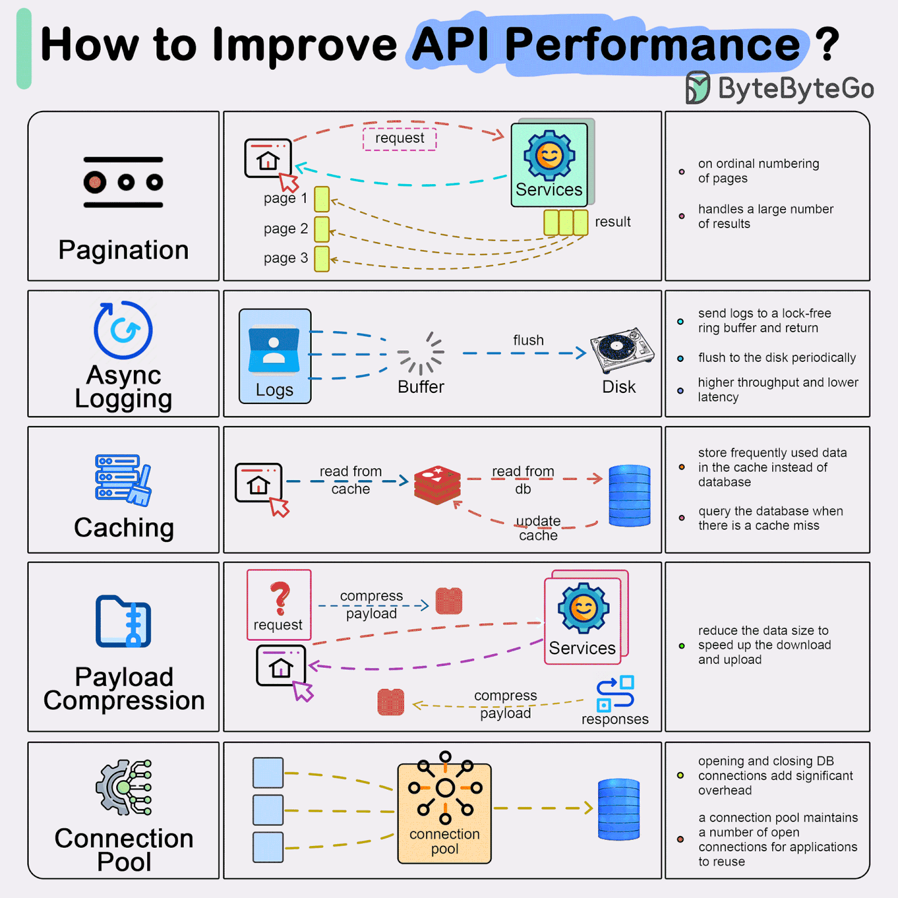

# Welcome to MkDocs

For full documentation visit [mkdocs.org](https://www.mkdocs.org).


## Commands

* `mkdocs new [dir-name]` - Create a new project.
* `mkdocs serve` - Start the live-reloading docs server.
* `mkdocs build` - Build the documentation site.
* `mkdocs gh-deploy` - Deploying to GitHub Pages.      
* `mkdocs -h` - Print help message and exit.

## Docker Run
    docker build -t mkdocs-site .
    docker-compose up

## Build Mkdocs
    1. Generate Static Files:
        > mkdocs build or  > mkdocs build --site-dir site  

    2. Install ghp-import (if not installed):
        > pip install ghp-import

    3. Deploy to GitHub Pages:
        > ghp-import -n -p -b gh-pages site

    4. Configure GitHub Pages:
        Go to your GitHub repository.
        Navigate to "Settings" > "Pages".
        Ensure the source branch is set to gh-pages.

    5. Access Your Site:
    Your site will be available at https://<username>.github.io/<repository>/.

## Header

    # H1 Header
    ## H2 Header
    ### H3 Header
    #### H4 Header
    ##### H5 Header
    ###### H6 Header

## Bold

    *Italic* or _Italic_
    **Bold** or __Bold__
    ***Bold Italic*** or ___Bold Italic___


## Lists

    ## Unordered Lists:-
        - Item 1
        - Item 2
          - Subitem 2.1
          - Subitem 2.2
        - Item 3

    ## Ordered Lists:-
        1. First item
        2. Second item
           1. Subitem 2.1
           2. Subitem 2.2
        3. Third item

## Links
    [Link Text](https://example.com "Your Name")

    For Direct use link:
    Visit our site at https://example.com for more information.

!!! note "Phasellus posuere in sem ut cursus"

    Lorem ipsum dolor sit amet, consectetur adipiscing elit. Nulla et euismod
    nulla. Curabitur feugiat, tortor non consequat finibus, justo purus auctor
    massa, nec semper lorem quam in massa.

## Images
    
    { align=left }
    { align=right }

    

## Code Blocks

    ```python
    def hello_world():
        print("Hello, world!")
    ```

## Blockquotes
    > This is a blockquote.
    > It can span multiple lines.

## Tables
    | Header 1 | Header 2 | Header 3 |
    |----------|----------|----------|
    | Row 1    | Data     | Data     |
    | Row 2    | Data     | Data     |

## Admonitions

!!! note "Note Title"
    This is a note.
!!! warning "Warning Title"
    This is a warning.

## Footnotes

    For more details, refer to the official documentation[^docs].

    [^docs]: [MkDocs Documentation](https://www.mkdocs.org/)

## GIF Load

Here is an example square GIF:



<figure markdown="span">
  { width="300" }
  <figcaption>Image caption</figcaption>
</figure>

## Video Load

Here is an example video:

<video width="600" controls>
  <source src="assets/videos/hacker.mp4" type="video/mp4">
  Your browser does not support the video tag.
</video>
